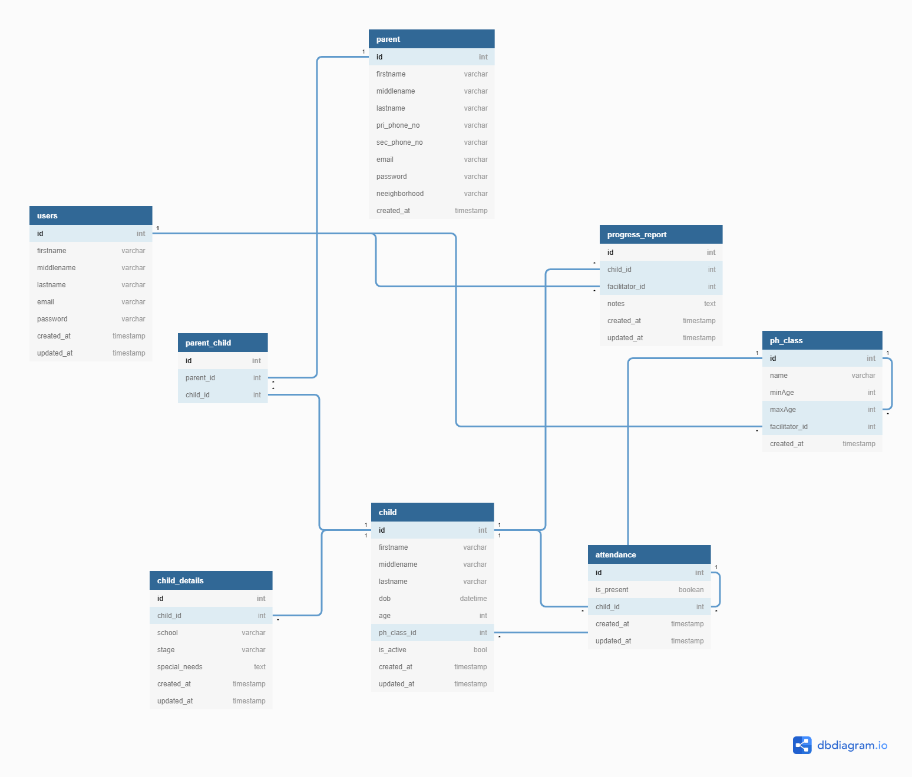

# Project Heritage API

---

> A server for Project Heritage application

## Prerequisites

- Python v 3.6
- Postgresql
- Python virtaulenv
- pip
- graphql
- heroku

## Installation

```bash
create virtualenv
source venv/bin/activate
pip install -r requirements.txt
mv example.env .env
python manage.py migrate
python manage.py runserver
```

## Database Schema



## Deployment

> We are using heroku to deploy

```bash
heroku create
heroku addons:add heroku-postgresql:dev
heroku addons:add newrelic
heroku pg:promote DATABASE_URL
heroku config:set ENVIRONMENT=PRODUCTION
heroku config:set DJANGO_SECRET_KEY=`./manage.py generate_secret_key`
```

## Author

> [Dennis Kamau](mailto:denniskamau3@gmail.com)

### Contributors

> [Victor Kariuki](mailto:karizvic@gmail.com)


## License

> MIT License
